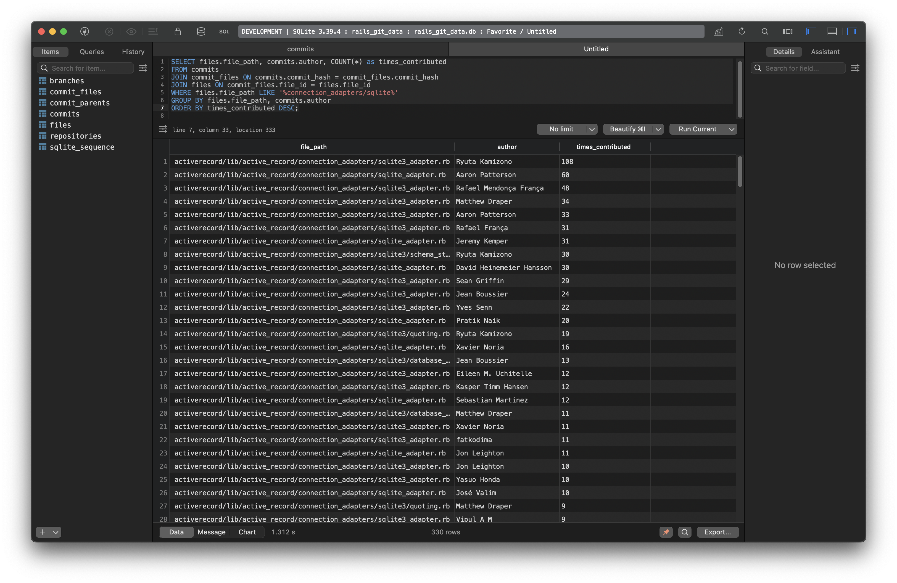
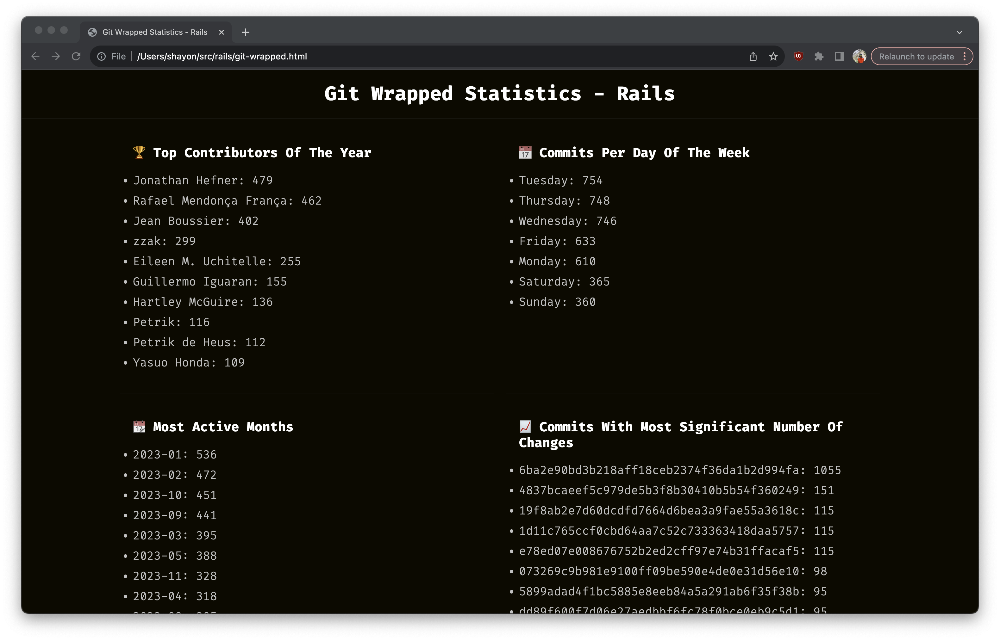

# BranchBase

[](https://github.com/shayonj/branch_base/actions/workflows/ci.yaml)
[](https://badge.fury.io/rb/branch_base)

`branch_base` is a Ruby gem to synchronize data from a Git repository into a SQLite database. It provides a CLI to easily build and store the data, including commits, branches, and file changes, into a SQLite database.

You can now easily run, any kind of analytics on your Git directory using the SQLite database.



## Features ✨

- Synchronize Git repository data into a SQLite database.
- Query commit history, branch details, and file changes using SQL.
- Easy-to-use CLI for quick setup and execution.
- 📸 Check out the example below on how you can use `branch_base` to create a Spotify themed Git Wrapped using SQL

## Usage 🛠️

After installation, you can use `branch_base` to generate a SQLite Database of a Git repository:

```bash
$ branch_base sync ~/src/rails
```

## Git wrapped 📸

Easily generate a Git wrapped with some built-queries and style using `branch_base`

```bash
$ branch_base git-wrapped ~/src/rails
2023-12-03 11:40:50 -0500: INFO - BranchBase: Generating Git wrapped for /Users/shayon/src/rails...
2023-12-03 11:40:53 -0500: INFO - BranchBase: Git wrapped JSON stored in /Users/shayon/src/rails/git-wrapped.json
2023-12-03 11:40:53 -0500: INFO - BranchBase: Git wrapped HTML stored in /Users/shayon/src/rails/git-wrapped.html
```



## Example SQL Queries 📊

Once your repository data is synchronized into a SQLite database, you can run various SQL queries to analyze the data. Here are some examples:

1. **List all commits**:

   ```sql
   SELECT * FROM commits;
   ```

2. **Find commits by a specific author**:

   ```sql
   SELECT * FROM commits WHERE author = 'John Doe';
   ```

3. **Get the number of commits in each branch**:

   ```sql
   SELECT branches.name, COUNT(commits.commit_hash) as commit_count
   FROM branches
   JOIN commits ON branches.head_commit = commits.commit_hash
   GROUP BY branches.name;
   ```

4. **List files changed in a specific commit**:

   ```sql
   SELECT files.file_path
   FROM commit_files
   JOIN files ON commit_files.file_id = files.file_id
   WHERE commit_files.commit_hash = 'ABC123';
   ```

5. **Count of Commits per Author**

   ```sql
   SELECT author, COUNT(*) as commit_count
   FROM commits
   GROUP BY author
   ORDER BY commit_count DESC;
   ```

6. **Authors Who Have Worked on a Specific File**

   ```sql
   SELECT files.file_path, commits.author, COUNT(*) as times_contributed
   FROM commits
   JOIN commit_files ON commits.commit_hash = commit_files.commit_hash
   JOIN files ON commit_files.file_id = files.file_id
   WHERE files.file_path LIKE '%connection_adapters/sqlite%'
   GROUP BY files.file_path, commits.author
   ORDER BY times_contributed DESC;
   ```

## Installation 📥

### Via RubyGems 💎

You can install `branch_base` directly using RubyGems:

```bash
$ gem install branch_base
```

### Via Docker 🐳

`branch_base` is also available as a Docker image, which can be used to run the tool without setting up a Ruby environment:

```bash
$ docker pull shayonj/branch_base:latest
```

To use `branch_base` with Docker, you can mount your Git repository as a volume:

```bash
$ docker run -v /repo/path:/repo shayonj/branch_base sync /repo
```

This command will create a SQLite database with the repository's data in the path where the command is called from

## Database Schema 🗺️

The SQLite database of the follow tables:

```
repositories
  │
  └─ commits ───── commit_files ── files
      │                  │              │
      ├─ branches ───────┘              │
      │                                 │
      └─ commit_parents ────────────────┘
```

**Table Descriptions**:

- `repositories`: Contains details about the repositories.
- `commits`: Stores individual commits. Each commit is linked to a repository.
- `branches`: Branch information linked to their latest commits.
- `files`: Information about files changed in commits. We don't store file contents.
- `commit_files`: Associates commits with files, including changes.
- `commit_parents`: Tracks parent-child relationships between commits.

## Contributing 🤝

Contributions to `branch_base` are welcome!

## License 📜

Distributed under the MIT License. See `LICENSE` for more information.

## Development 💻

- Install ruby `3.1.4` using RVM ([instruction](https://rvm.io/rvm/install#any-other-system))
- `bundle exec rspec` for specs
